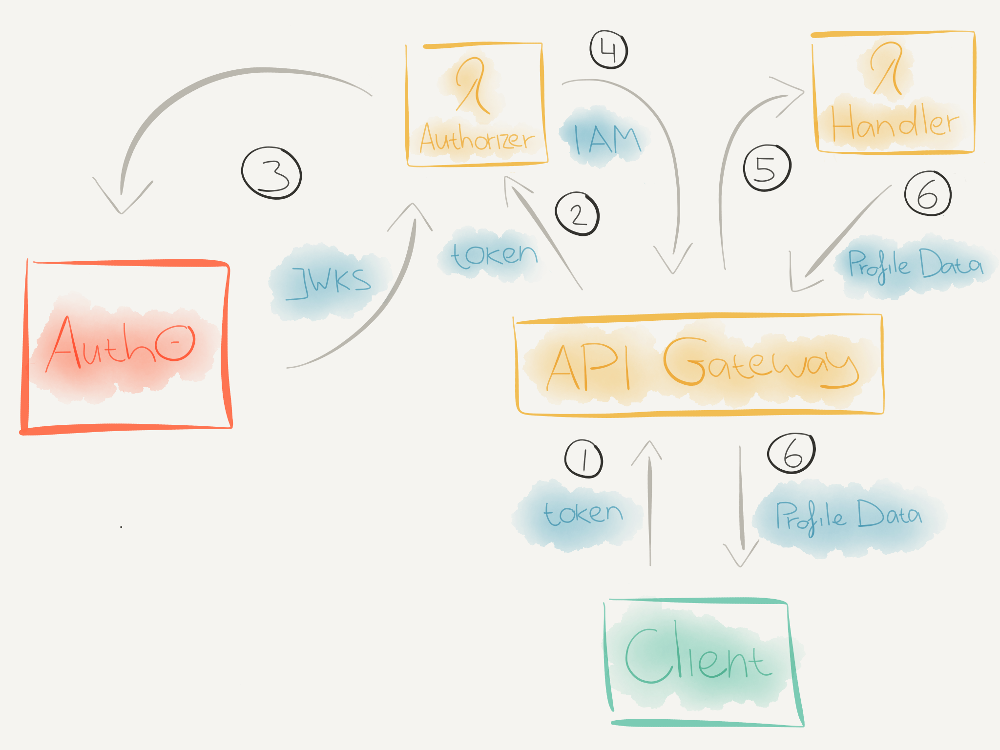

# Serverless auth

Code for the accompanying [blog post](https://blog.danillouz.dev/serverless-auth).

# Use case

> How can we secure an HTTP API with a token based authentication strategy, so only authenticated- and authorized clients can access it?

## Technologies

- The HTTP API is an [AWS API Gateway](https://docs.aws.amazon.com/apigateway/latest/developerguide/welcome.html).
- The API endpoints are protected with a [bearer token](https://oauth.net/2/bearer-tokens) and implemented as [Lambda Proxy Integrations](https://docs.aws.amazon.com/apigateway/latest/developerguide/set-up-lambda-proxy-integrations.html).
- [Auth0](https://auth0.com) is used as a third party auth provider.
- An [APIG Lambda Authorizer](https://docs.aws.amazon.com/apigateway/latest/developerguide/apigateway-use-lambda-authorizer.html) is used to verify the token with Auth0.
- The Lambdas are implemented using [Node.js](https://nodejs.org/en) and the [Serverless Framework](https://serverless.com).
- [cURL](https://en.wikipedia.org/wiki/CURL) is used as a "client" to send HTTP requests to the API with a token.

## Auth flow



1. `curl` will send an HTTP request to the `GET /profile` endpoint with a token via the `Authorization` request header.
2. When the HTTP request reaches APIG, it will check if a Lambda Authorizer is configured for the called endpoint. If so, APIG will invoke the Lambda Authorizer.
3. The Lambda Authorizer will then:

   - Extract the token from the `Authorization` request header.
   - Fetch the JWKS (which contains the public key) from Auth0.
   - Verify the token signature with the fetched public key.
   - Verify the token has the correct issuer and audience claims.

4. If the token is verified, the Lambda Authorizer will return an IAM Policy document with `Effect` set to `Allow`.
5. APIG will now evaluate the IAM Policy and if the `Effect` is set to `Allow`, it will invoke the specified Lambda handler.
6. The Lambda handler will execute and when the `get:profile` scope is present, it will return the profile data back to the client.

# Development

Lint source code with:

```shell
npm run lint
```

Lint and format (prettier) source code with:

```shell
npm run lint:format
```

Run tests with:

```shell
npm test
```

# Contributing

Please read the [Contributing Guidelines](CONTRIBUTING.md) first.

# Licence

MIT License

Copyright (c) Daniël Illouz
